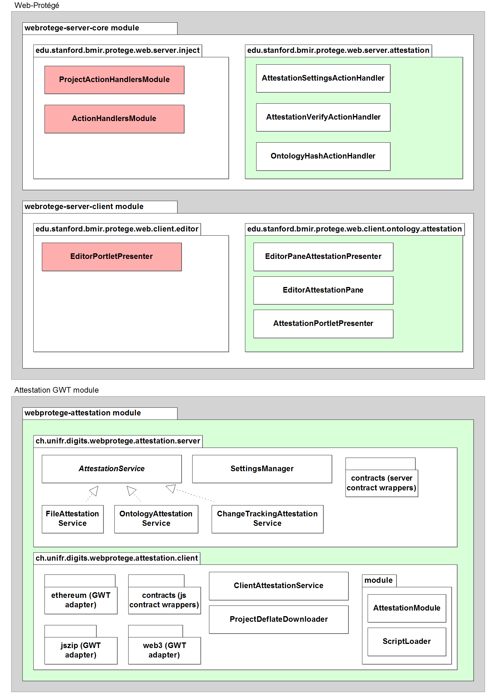

Fork of WebProtégé implementing ontology attestation and verification
==========

Modification of the WebProtégé ontology editor to support ontology attestation by implementing a custom portlet. See the original readme below for 
instructions for WebProtégé in general. 

## Relevant links
- [Attesattion module](https://github.com/curtys/webprotege-attestation)
- [Dataset](https://github.com/curtys/webprotege-attestation/tree/master/dataset) and results used for publication

## Requirements

- the **attestation module** implementing most of the functionality: https://github.com/curtys/webprotege-attestation
- docker-compose
- Java 8 and Maven

## Building

- follow the building instructions of the **attestation module**
- run `mvn clean package` to build WebProtégé

## Starting in DevMode

- first, consider following the instructions of the **attestation module** to set up an Ethereum test network
- start the database with `docker-compose up -d devmongo`
- start the GWT code server with `mvn gwt:codeserver`
- start a tomcat server instance with `mvn -Denv=dev tomcat7:run`
- first time starting up (or after resetting the database) an admin user has to be created. 
  Executed the **webprotege-cli** JAR (compile it, if not already done). E.g., 
  `java -jar webprotege-cli/target/webprotege-cli.jar create-admin-account`
- by default, WebProtégé is available on port 8080.

## Changes made in this fork
Some key classes were altered to integrate an attestation 
portlet in the editor. The portlet can be added by choosing 'Attestation' from the list of available portlets, 
e.g. when adding a new tab.
In the graphic below the altered classes are marked in red and the added packages in green.



WebProtégé (original readme)
==========

What is WebProtégé?
-------------------

WebProtégé is a free, open source collaborative ontology development environment.

It provides the following features:
- Support for editing OWL 2 ontologies
- A default simple editing interface, which provides access to commonly used OWL constructs
- Full change tracking and revision history
- Collaboration tools such as, sharing and permissions, threaded notes and discussions, watches and email notifications
- Customizable user interface
- Support for editing OBO ontologies
- Multiple file formats for upload and download of ontologies (supported formats: RDF/XML, Turtle, OWL/XML, OBO, and others)

WebProtégé runs as a Web application. End users access it through their Web browsers.
They do not need to download or install any software. We encourage end-users to use

https://webprotege.stanford.edu

If you have downloaded the webprotege war file from GitHub, and would like to deploy it on your own server,
please follow the instructions at:

https://github.com/protegeproject/webprotege/wiki/WebProtégé-4.0.0-beta-x-Installation

Building
--------

To build WebProtégé from source

1) Clone the github repository
   ```
   git clone https://github.com/protegeproject/webprotege.git
   ```
2) Open a terminal in the directory where you clone the repository to
3) Use maven to package WebProtégé
   ```
   mvn clean package
   ```
5) The WebProtege .war file will be built into the webprotege-server directory

Running from Maven
------------------

To run WebProtégé in SuperDev Mode using maven

1) Start the GWT code server in one terminal window
    ```
    mvn gwt:codeserver
    ```
2) In a different terminal window start the tomcat server
    ```
    mvn -Denv=dev tomcat7:run
    ```
3) Browse to WebProtégé in a Web browser by navigating to [http://localhost:8080](http://localhost:8080)

Running from Docker
-------------------

To run WebProtégé using Docker containers:

1. Enter this following command in the Terminal to start the docker container in the background

   ```bash
   docker-compose up -d
   ```

2. Create the admin user (follow the questions prompted to provider username, email and password)

   ```bash
   docker exec -it webprotege java -jar /webprotege-cli.jar create-admin-account
   ```

3. Browse to WebProtégé Settings page in a Web browser by navigating to [http://localhost:5000/#application/settings](http://localhost:5000/#application/settings)
   1. Define the `System notification email address` and `application host URL`
   2. Enable `User creation`, `Project creation` and `Project import`

To stop WebProtégé and MongoDB:

   ```bash
   docker-compose down
   ```

Sharing the volumes used by the WebProtégé app and MongoDB allow to keep persistent data, even when the containers stop. Default shared data storage:

* WebProtégé will store its data in the source code folder at `./.protegedata/protege` where you run `docker-compose`
* MongoDB will store its data in the source code folder at `./.protegedata/mongodb` where you run `docker-compose`

> Path to the shared volumes can be changed in the `docker-compose.yml` file.
